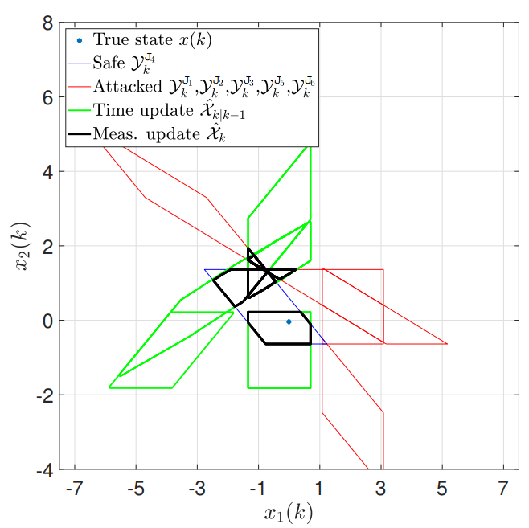

## Secure-Set-Based-Estimation
<br/> 
This repo cotains the code for our two papers:

<br/><br/>
1- Muhammad Umar B. Niazi, Amr Alanwar, Michelle S. Chong, Karl H. Johansson "Resilient Set-based State Estimation for Linear Time-Invariant Systems Using Zonotopes"
European Journal of Control ( [link](https://arxiv.org/abs/2211.08474) )

<br/><br/>
2- Muhammad Umar B. Niazi, Michelle S. Chong, Amr Alanwar, Karl H. Johansson "Secure Set-Based State Estimation for Multi-Sensor Linear Systems under Adversarial Attacks" Submitted to Automatica  ( [link]() ) 
 
## Problem Statement
We consider the problem of set-based state estimation for linear time-invariant (LTI) systems under time-varying sensor attacks.
Provided that the LTI system is stable and observable via every single sensor and that at least one sensor is uncompromised, 
we guarantee that the true state is always contained in the estimated set. We use zonotopes to represent these sets for computational efficiency. 
However, we show that intelligently designed stealthy attacks may cause exponential growth in the algorithm's worst-case complexity.
We present several strategies to handle this complexity issue and illustrate our resilient zonotope-based state estimation algorithm on a rotating target system.
<br /> <br />
<p align="center">

</p>
<br />
<br />

## Files Description 
There are two levels of complexity for the proposed data driven reachability analysis<br />
A- Basic reachability analysis under the folder examples-basic<br /><br />
B- Advanced reachability analysis using constrained matrix zonotope under the folder examples-cmz.
These files compare three methods for reachability analysis namely, matrix zonotope, constrained matrix
zonotop using exact noise description and constrained matrix zonotope given side information.<br />
<br />

## Running 
1- Download [CORA 2020](https://tumcps.github.io/CORA/data/CORA_2020.zip) and [MPT](https://www.mpt3.org) toolboxs.<br />
2- Add CORA and MPT folder and subfolders to the Matlab path.  <br />
3- Add the repo folder and subfolders to the Matlab path.  <br />
4- run TwoSensorsExample.m for linear system using two sensors.<br />
5- run FourSensorsExample.m for linear system using four sensors.<br />
6- run BuildingExample.m for three-story building structure.<br />
<br />
<br />


Our papers Bibtex are as follow:<br />
```
@article{niazi2022resilient,
  title={Resilient Set-based State Estimation for Linear Time-Invariant Systems Using Zonotopes},
  author={Niazi, Muhammad Umar B and Alanwar, Amr and Chong, Michelle S and Johansson, Karl Henrik},
  journal={arXiv preprint arXiv:2211.08474},
  year={2022}
}

```

